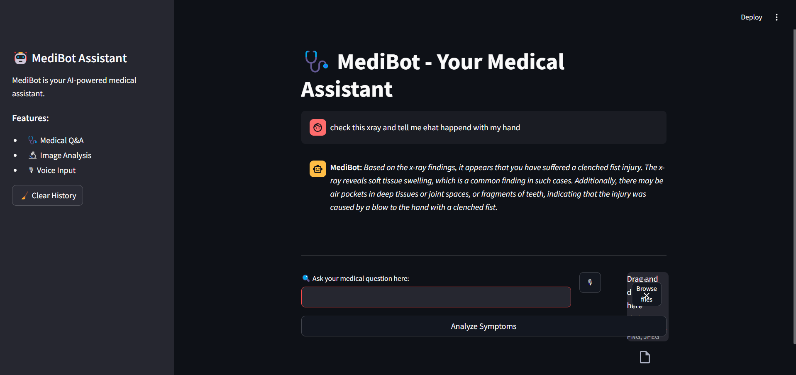

#MediScan-AI-multi-model-AI-application
MediScan-AI is a smart, multimodal AI-driven medical assessment tool that analyzes symptoms and medical reports to provide disease detection and suggestions. It supports multiple input formats, including text, voice chat, medical reports with queries, and reports with voice input, ensuring a seamless and versatile diagnostic experience.

#### 🏥 MediScan-AI – Multimodal AI Medical Assistant 🤖

🔬 MediScan-AI is a cutting-edge AI-powered medical assistant that analyzes symptoms and medical reports to detect diseases and suggest treatments. It supports multiple input formats for a seamless health assessment experience.

#### ✨ Key Features
- **✅ AI-Powered Diagnosis –** Provides professional medical assessments
- **🎙 Voice Chat Support –** Converts speech to text using Whisper
- **📄 Report Analysis –** Upload medical reports for AI-based suggestions
- **🖼 Image-Based Diagnosis –** Uses Groq API (LLaMA-3 Vision) for medical image analysis
- **🔊 AI Voice Response –** Converts AI-generated responses into natural speech using ElevenLabs API
- **🛠 Multi-Modal Input –** Supports text, voice, reports + text, reports + voice

#### 📌 How It Works?
- 1️⃣ User Input: Enter symptoms via text, voice, or report
- 2️⃣ AI Analysis: Uses LLaMA-3, Whisper, and Groq API for processing
- 3️⃣ Medical Assessment: AI suggests possible conditions and remedies
- 4️⃣ Voice Response: ElevenLabs converts the doctor’s response into speech

#### 🔧 Tech Stack
- **🚀 Backend:** Python, Streamlit
- **🧠 AI Models:** Groq API (LLaMA-3 Vision) for medical analysis
- **🎤 Speech-to-Text:** Whisper for converting voice input to text
- **🔊 Text-to-Speech:** ElevenLabs API for natural voice responses

#### 🚀 Installation & Setup
#####  Step 1: Clone the Repository :
             git clone https://github.com/shubham3032002/MediScan-AI-multi-model-AI-application.git

#####   Step 2: Install Dependencies:
             pip install -r requirements.txt

#####   Step 3: Set Up API Keys
             GROQ_API_KEY=your_groq_api_key  
             ELEVENLABS_API_KEY=your_elevenlabs_api_key  
             HF_TOKEN =Hagging_face_api

##### Step 4: Run the App
             streamlit run app.py

#### 🎯 Usage
- **✅ Text Only:** Enter symptoms manually
- **✅ Voice Chat:** Speak to the AI doctor
- **✅ Report + Query:** Upload a medical report with additional queries
- **✅ Report + Voice Input:** Upload a report and explain symptoms via voice             

                           
#### 📸 Screenshots                          

#### 📜 License
📝 This project is licensed under the MIT License.

👨‍⚕️ MediScan-AI – Your AI-Powered Health Assistant! 🚑